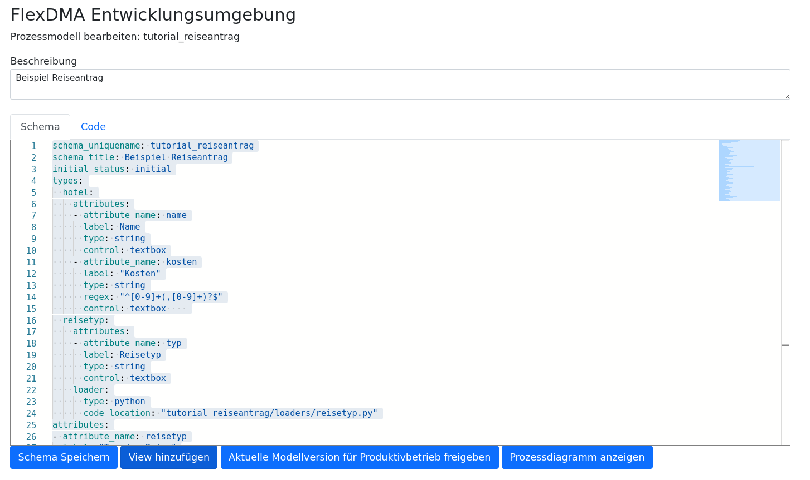
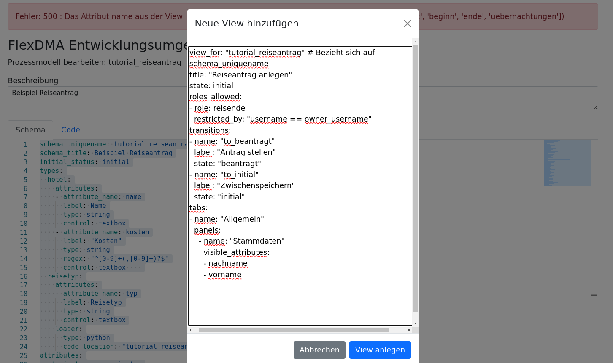

# FlexDMA Schnelleinstieg

Das nachfolgende Tutorial bietet einen Schnelleinstieg in die wichtigsten Features der Workflow-Engine FlexDMA am Beispiel eines Reiseantragsworkflows.


## Schrittweises Vorgehen in der Entwicklungsumgebung

### Neues Prozessmodell anlegen


Es beginnt mit einen Klick auf den Button __Neues Prozessmodell anlegen__.


Danach erhalten Sie ein neues leeres Prozessmodell, in dessen Schema bereits ein minimales Code-Beispiel mit einem einzelnen Attribut (sample) bereitgestellt wird.


Danach können Sie im Reiter Schema das Datenmodell ihres Prozessmodells definieren. Es soll am Ende alle Felder enthalten, die in den Prozessschritten benötigt werden.

### Vollständiges Schema des Beispiel-Reiseantrags

```yaml
schema_uniquename: tutorial_reiseantrag
schema_title: Beispiel Reiseantrag
initial_status: initial
types:
  hotel:
    attributes:
    - attribute_name: name
      label: Name
      type: string
      control: textbox
    - attribute_name: kosten
      label: "Kosten"
      type: string
      regex: "^[0-9]+(,[0-9]+)?$"
      control: textbox    
  reisetyp:
    attributes:
    - attribute_name: typ
      label: Reisetyp
      type: string
      control: textbox
    loader:
      type: python
      code_location: "tutorial_reiseantrag/loaders/reisetyp.py"
attributes:
- attribute_name: reisetyp
  label: "Typ der Reise"
  type: reisetyp
  control: select
  required: true
- attribute_name: vorname
  label: Vorname
  type: string
  control: textbox
  required: true
- attribute_name: nachname
  label: Nachname
  type: string
  control: textbox
  required: true
- attribute_name: zielort
  label: Zielort
  type: string
  control: textbox  
- attribute_name: beginn
  label: Reisebeginn
  type: date
  control: datepicker
- attribute_name: ende
  label: Reiseende
  type: date
  control: datepicker
- attribute_name: uebernachtungen
  label: "Übernachtungen"
  type: hotel
  cardinality: many
  control: tableedit
- attribute_name: genehmigungskommentar
  label: "Kommentar der/des Vorgesetzten"
  type: string
  control: textarea
```

Für das Attribut _reisetyp_ vom Typ _reisetyp_ ist im Schema ein dynamisches Laden mittels eigenem Code in Python oder SQL vorgesehen worden. Aus diesem Grund muss als nächstes die dafür vorgesehene Funktion im Reiter __Code__ definiert werden. Wie das geht zeigt der nächste Screenshot.


Damit sind die grundlegenden Arbeiten an unserem Prozessmodell abgeschlossen und wir können uns nun um die Abbildung der einzelnen Prozessschritte kümmern.

### Abbildung der Prozessschritte als Views

Durch einen Klick auf den Button __View hinzufügen__ in der folgenden Maske kann eine neue View angelegt werden.



Nach dem Klick erscheint ein Dialog, der bereits einen Code-Vorlage für die Erstellung der View mit empfehlungen für die verpflichtend zu definierenden und einige weitere Attribute beinhaltet. 


Dieser Code kann nun vor dem tatsächlichen Anlegen der View noch wie im folgenden Screenshot angepasst werden.



Nach dem Klick auf __View anlegen__ erscheint die neue View dann in einem neuen Tab im Quellcodeeditor. 


Dort lässt sie sich über den Button __View-Vorschau__ auch schon so betrachten, wie sie in der finalen Anwendung dann aussehen wird.


Nun kann die View des Antragstellers so gestaltet werden, wie sie final aussehen soll.


Das hat dann in der Vorschau das folgende Resultat:


Hier noch der vollständige Code unserer ersten View:

```yaml
view_for: "tutorial_reiseantrag" # Bezieht sich auf schema_uniquename
title: "Reiseantrag anlegen"
state: initial 
roles_allowed: 
- role: reisende
  restricted_by: "username == owner_username"
transitions: 
- name: "to_beantragt"
  label: "Antrag stellen"
  state: "beantragt"
- name: "to_initial"
  label: "Zwischenspeichern"
  state: "initial"
tabs:
- name: "Allgemein"
  panels:
    - name: "Stammdaten"
      visible_attributes:
      - nachname
      - vorname
    - name: "Reisedaten"
      visible_attributes:
      - reisetyp
      - zielort
      - beginn
      - ende
```

Damit ist die erste View unseres Prozessmodells erfolgreich erzeugt. Im Code-Abschnitt __transitions__ enthält unsere erste View übrigens auch schon den Übergang zur nächsten View __Reiseantrag prüfen__, die für Nutzende mit der Rolle _vorgesetzte_ bereitsteht und alle Anträge im Status _beantragt_ zur Bearbeitung bereitstellt.

Über die Einschränkung (__restricted_by__) wird festgelegt, dass Reisende in dieser View nur ihre eigenen Reiseanträge sehen dürfen.

### Eine View für Reiseantrag prüfen anlegen

Das Vorgehen zur Anlage der View _Reiseantrag prüfen_ ist exakt das gleiche wie bei der View _Reiseantrag stellen_.

Der resultierende Code sieht wie folgt aus:

```yaml
view_for: "tutorial_reiseantrag" # Bezieht sich auf schema_uniquename
title: "Reiseantrag prüfen"
state: beantragt 
roles_allowed: 
- role: vorgesetzte
transitions: 
- name: "to_initial"
  label: "Antrag ablehnen"
  state: "initial"
  post_transition:
    code_location: "tutorial_reiseantrag/transitions/send_email.py"
- name: "to_genehmigt"
  label: "Antrag genehmigen"
  state: "genehmigt"
  post_transition:
    code_location: "tutorial_reiseantrag/transitions/send_email.py"
tabs:
- name: "Allgemein"
  panels:
    - name: "Stammdaten"
      visible_attributes:
      - nachname
      - vorname
    - name: "Reisedaten"
      visible_attributes:
      - reisetyp
      - zielort
      - beginn
      - ende
    - name: "Kommentare"
      visible_attributes:
      - genehmigungskommentar
readonly_fields:
- vorname
- nachname
- zielort
- beginn
- ende
```

Die Maske enthält nun einige Felder, die vom Vorgesetzten nicht bearbeitet werden dürfen, eine E-Mail-Benachrichtigung an den Antragsteller bei Genehmigung und Ablehnung sowie vollständige Sichtrechte aller Nutzer mit der Rolle __vorgesetzte__ auf alle Anträge im Status __beantragt__.

Die Vorschau der Maske:


Auf die gleiche Weise werden nun alle weiteren laut Prozessdiagramm erforderlichen Views erzeugt.

Das von FlexDMA automatisch generierte Diagramm zum abgebildeten Prozess sieht wie folgt aus:


Ein Durchlauf durch den daraus resultierenden Prozess wird im folgenden Video gezeigt.


Den vollständigen Code der Views finden Sie unter [src/views](src/views/) in diesem Repository.

Dieses Tutorial zeigt nur einen Ausschnitt aus den verfügbaren Funktionen der aktuellen Version von FlexDMA.